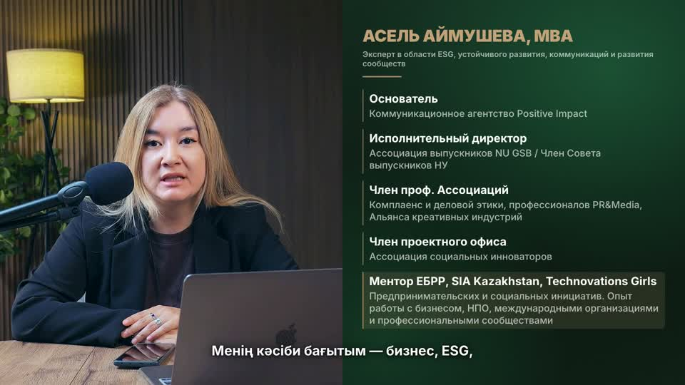
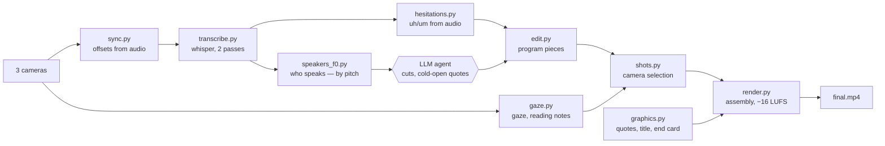

# Montage Agent — an AI agent that edits interviews and video lessons

🇷🇺 [Русская версия](README.ru.md)

**Team:** Ozge media (Astana, Kazakhstan) · **Hackathon:** AI Alem

The agent takes raw footage (a three-camera interview, or a single-speaker lesson with slides) and delivers a finished video. It syncs the cameras, transcribes the speech, and cuts pauses, "uh"/"um" hesitations and false starts. It picks the camera by where the speaker is looking and builds a cold open from the strongest quotes. It also adds name titles, a title card and an end card. Client feedback such as "make the transitions smoother" or "don't show me reading from my notes in the wide shot" becomes a checkable rule, and the agent re-renders the video.

🎬 **Demo:** [`demo/lesson_demo_asel_60s.mp4`](demo/lesson_demo_asel_60s.mp4) — the first minute of an ASI course lesson, *Social Entrepreneurship: Business Models and Sustainability* (speaker: Asel Aimusheva). The Kazakh subtitles, the name title and the animated slide panels were produced by the agent.



---

## Problem

Social entrepreneurs, NGOs and event organisers in Kazakhstan need a lot of video: speaker interviews, lessons, event recaps. A human editor spends 1–2 days on a single three-camera interview. Most of that time is routine work: syncing cameras, cleaning up speech, switching angles, adding titles.

## Solution

An LLM agent (Claude Code) drives a pipeline of small, verifiable scripts. The scripts do the heavy audio and video work. The agent reads the transcript, makes the editorial decisions, shows the edit decision list for approval and applies the client's changes.

| | Human editor | Agent |
|---|---|---|
| 17-min interview, 3 cameras → 13:49 video | 1–2 days | ~2 hours including revisions; render ~12 min on a MacBook M1 (8 GB) |
| Pauses, hesitations, filler words, false starts removed | by hand | 149 cuts (~2.5 min) |
| Client revisions | redone by hand | 4 versions, rules accumulate |

## How it works (interview mode)



| Step | Script | What it does |
|---|---|---|
| 1 | `sync.py` | Syncs cameras by audio cross-correlation on three stretches of the recording, checks drift, picks the master audio |
| 2 | `transcribe.py` | faster-whisper large-v3-turbo with word timestamps: a normal pass and a verbatim pass (filler words, false starts) |
| 3 | `speakers_f0.py` | Labels host / guest by voice pitch and level on the close-up cameras |
| 4 | `gaze.py` | MediaPipe FaceMesh: is the person looking into the centre camera or at the other person; is the host reading from her notes (eyelid opening) |
| 5 | `hesitations.py` | Finds "uh", "um" and drawn-out vowels from the audio (steady pitch + static timbre) — whisper does not transcribe them |
| 6 | `edit.py` | Builds the program: agent cuts (filler words, false starts, content cuts) + pauses and hesitations. Cut points are placed in silence |
| 7 | `shots.py` | Picks cameras by the rules below and verifies them itself |
| 8 | `graphics.py`, `lower_thirds.py` | Cold-open quotes with words appearing in time with speech, title card over event footage, name titles, end card with logos |
| 9 | `render.py` | Assembles the video in pieces with cross-dissolves, audio with crossfades and a limiter, EBU R128 loudness normalisation |

### Editing rules the agent follows and checks

The rules come from real client feedback ([docs/editing_rules.md](docs/editing_rules.md)):

- **A close-up shows only the person who is speaking.** A shot never runs across a change of speaker.
- **Eye contact with the viewer.** Looking into the centre camera → wide shot; the host's introduction runs entirely on the centre camera.
- **Wide shot only while the host is listening to the guest**, not while she is reading questions from her notes.
- **The centre-of-frame decor** (traditional *körpe* quilts) appears only in wide shots; the host's close-up is cropped to exclude it.
- **No jarring close–wide–close jumps.** Every cut is a soft 0.2–0.3 s dissolve.
- **Cold open in the style of *The Diary Of A CEO*:** 4 strong quotes (a number, a conflict, a personal admission), zoom transitions with a whoosh, music chosen by the client.
- **Pauses over 0.4 s → ~0.25 s; hesitations → 0.2 s; filler words and false starts are removed**, and the text at every cut is checked.

`shots.py` report after each build:
```
shots 46   duration min/median/max 2.3 9.0 61.5
close-up of the wrong speaker (>1 s): []
wide shots where the host reads >15%: []
```

## Lesson mode (`lesson/`)

One speaker plus a slide deck. The agent renders the slides and cuts retakes and pauses. It builds text panels and animated infographics from the deck, makes ru → kk subtitles and adds the end card. Step order is in [lesson/PIPELINE.md](lesson/PIPELINE.md) (in Russian). The demo lesson was produced in this mode.

## Running it

Requires Python 3.11, ffmpeg and the Montserrat variable font in `assets/fonts/`.

```bash
python3.11 -m venv .venv && .venv/bin/pip install -r requirements.txt
export MONTAGE_PROJECT=~/Projects/my-interview     # project folder
cp examples/project.example.json  $MONTAGE_PROJECT/project.json
cp examples/speakers.example.json $MONTAGE_PROJECT/data/speakers.json
# footage: $MONTAGE_PROJECT/source/…, music and logos: $MONTAGE_PROJECT/assets/…

cd interview
../.venv/bin/python sync.py
../.venv/bin/python transcribe.py && ../.venv/bin/python transcribe.py verbatim
../.venv/bin/python speakers_f0.py
../.venv/bin/python gaze.py close && ../.venv/bin/python gaze.py wide && ../.venv/bin/python gaze.py eyes
../.venv/bin/python hesitations.py
# ← the agent reads the transcript, fills edits / triggers / host_segments in project.json; the client approves the edit list
../.venv/bin/python edit.py && ../.venv/bin/python shots.py
../.venv/bin/python lower_thirds.py && ../.venv/bin/python graphics.py && ../.venv/bin/python sfx.py
../.venv/bin/python render.py                      # → $MONTAGE_PROJECT/output/final.mp4
```

The prompt the agent works from: [docs/agent_prompt.md](docs/agent_prompt.md).

## Under the hood

- **Sync without a clapper:** FFT cross-correlation of the audio on three stretches; on the real interview the drift over 13 minutes was under 4 ms.
- **Hesitations from audio:** autocorrelation via the spectrum (voicing and pitch) plus how much the spectral bands change over 50 ms (timbre). Only steady voicing lasting ≥0.3 s is cut.
- **Pauses that actually contain speech:** if whisper missed a word, the pause contains voicing with changing pitch — the agent does not cut such pauses.
- **Gaze:** head turn (nose relative to the eyes) + iris position; reading notes = eyelid opening < 0.30, smoothed to ignore blinks.
- **Rendering on 8 GB RAM:** video is encoded in pieces with exact frame counts and joined without re-encoding. Dissolves are made inside the pieces with `xfade`, continuing the previous source, so the audio never drifts.

Code comments and console messages are in Russian — the tool was built for a Russian- and Kazakh-speaking production team.

## Data and rights

- Interview footage, transcripts and the real project's settings are not included (speakers' personal data).
- Music in the demo lesson: *Inspired* — Kevin MacLeod (incompetech.com), CC BY 4.0.
- The transition whoosh and the fallback tension music are synthesised in code (`sfx.py`, `music_tension.py`) — no third-party samples.

## License

MIT — see [LICENSE](LICENSE).
