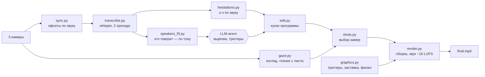
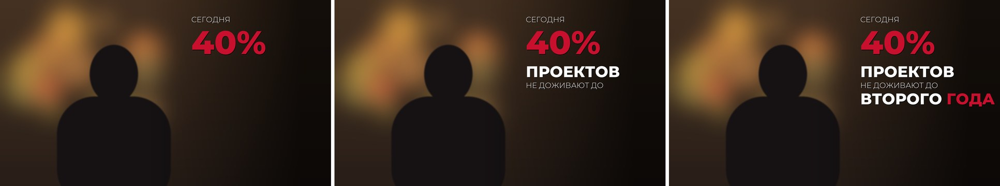

# Montage Agent — ИИ-агент монтажа интервью и видеоуроков

🇬🇧 [English version](README.md)

**Команда:** Ozge media (Астана) · **Хакатон:** AI Alem

Агент получает сырые исходники (три камеры и звук интервью или урок со слайдами) и собирает готовый ролик: синхронизирует камеры, расшифровывает речь, вырезает паузы, «э-э» и неправильные повторы, выбирает камеру по взгляду говорящего, делает перебивку из сильных фраз, плашки ФИО, заставку и финал. Правки заказчика («переходы плавнее», «на общем плане я не должна читать с листа») агент превращает в проверяемые правила и пересобирает ролик.

▶️ **Видео-демо (1:45, YouTube):** https://youtu.be/GARec2zQ-ng

🎬 **Демо:** [`demo/lesson_demo_asel_60s.mp4`](demo/lesson_demo_asel_60s.mp4) — первая минута урока ASI «Социальное предпринимательство: бизнес-модели и устойчивость» (спикер — Асель Аймушева). Субтитры на казахском, плашка ФИО и анимированные панели слайдов сделаны агентом.


---

## Проблема

Соцпредпринимателям, НКО и организаторам мероприятий в Казахстане нужно много видео: интервью со спикеров, уроки, отчёты. Монтаж одного интервью на три камеры у монтажёра занимает 1–2 дня. Большая часть этого времени уходит на рутину: синхронизацию, чистку речи, переключение камер, титры.

## Решение

LLM-агент (Claude Code) управляет конвейером из небольших проверяемых скриптов. Скрипты делают тяжёлую работу со звуком и видео. Агент читает расшифровку, принимает решения монтажёра, показывает монтажный лист на утверждение и вносит правки.

| | Монтажёр | Агент |
|---|---|---|
| Интервью 17 мин, 3 камеры → ролик 13:49 | 1–2 дня | ~2 часа с правками, рендер ~12 мин на MacBook M1 (8 ГБ) |
| Вырезано пауз, «э-э», паразитов, повторов | вручную | 149 мест (~2,5 мин) |
| Правки заказчика | переделка руками | 4 версии ролика по правкам, правила копятся |

## Как работает (режим «интервью»)



| Шаг | Скрипт | Что делает |
|---|---|---|
| 1 | `sync.py` | Синхронизирует камеры кросс-корреляцией звука на трёх участках, проверяет дрейф, выбирает мастер-звук |
| 2 | `transcribe.py` | faster-whisper large-v3-turbo с пословными таймкодами: обычный проход и дословный (паразиты, оговорки) |
| 3 | `speakers_f0.py` | Размечает «ведущая / гость» по основному тону голоса и уровню на крупных камерах |
| 4 | `gaze.py` | MediaPipe FaceMesh: смотрит ли человек в центральную камеру или на собеседника; читает ли ведущая с листа (раскрытие век) |
| 5 | `hesitations.py` | Находит «э-э», «м-м» и растянутые гласные по звуку (ровный тон + неподвижный тембр) — whisper их не пишет |
| 6 | `edit.py` | Строит программу: вырезки агента (паразиты, повторы, «по смыслу») + паузы и запинки. Точки склейки ставит в тишине |
| 7 | `shots.py` | Выбирает камеры по правилам (см. ниже) и сам проверяет их выполнение |
| 8 | `graphics.py`, `lower_thirds.py` | Фразы-триггеры со словами в ритм речи, заставка поверх видео мероприятия, плашки ФИО, финал с логотипами |
| 9 | `render.py` | Собирает видео кусками с растворениями, звук с кроссфейдами и лимитером, нормализует по EBU R128 |

### Правила монтажа, которые агент выполняет и проверяет

Правила появились из реальных правок заказчика ([docs/editing_rules.ru.md](docs/editing_rules.ru.md)):

- **Крупный план — только того, кто говорит.** План не переходит через смену говорящего.
- **Контакт со зрителем.** Взгляд в центральную камеру → общий план; вступление ведущей целиком на центральной камере.
- **Общий план — только когда ведущая слушает гостя**, а не читает вопросы с листа.
- **Декор в центре кадра** (корпе) — только на общем плане; крупный план ведущей кадрируется без него.
- **Никаких резких «близко–далеко».** Склейки — мягкое растворение 0,2–0,3 с.
- **Перебивка в стиле The Diary Of A CEO:** 4 сильные фразы (цифра, конфликт, личное признание), переходы «зумом» со звуком, музыка по выбору заказчика.
- **Паузы длиннее 0,4 с → ~0,25 с; «э-э» → 0,2 с; паразиты и неправильные повторы вырезаются**, но каждая вырезка проверяется по тексту на стыке.

Типографика перебивки — слова появляются ровно тогда, когда их произносят (иллюстрация, фраза условная):



Отчёт `shots.py` после каждой сборки:
```
планов 46 длит. мин/медиана/макс 2.3 9.0 61.5
крупный не того, кто говорит (>1 с): []
общие, где ведущая читает >15%: []
```

## Режим «урок» (`lesson/`)

Один спикер + презентация. Агент рендерит слайды, вырезает дубли и паузы, собирает текстовые панели и анимированную инфографику из дека, делает субтитры ru → kk и финальную плашку. Порядок шагов — в [lesson/PIPELINE.md](lesson/PIPELINE.md). Этим режимом собран демо-урок.

## Запуск

Нужны Python 3.11, ffmpeg и шрифт Montserrat (variable) в `assets/fonts/`.

```bash
python3.11 -m venv .venv && .venv/bin/pip install -r requirements.txt
export MONTAGE_PROJECT=~/Projects/my-interview     # папка проекта
cp examples/project.example.json  $MONTAGE_PROJECT/project.json
cp examples/speakers.example.json $MONTAGE_PROJECT/data/speakers.json
# исходники: $MONTAGE_PROJECT/source/…, музыка и логотипы: $MONTAGE_PROJECT/assets/…

cd interview
../.venv/bin/python sync.py
../.venv/bin/python transcribe.py && ../.venv/bin/python transcribe.py verbatim
../.venv/bin/python speakers_f0.py
../.venv/bin/python gaze.py close && ../.venv/bin/python gaze.py wide && ../.venv/bin/python gaze.py eyes
../.venv/bin/python hesitations.py
# ← агент читает расшифровку, заполняет edits / triggers / host_segments в project.json, заказчик утверждает монтажный лист
../.venv/bin/python edit.py && ../.venv/bin/python shots.py
../.venv/bin/python lower_thirds.py && ../.venv/bin/python graphics.py && ../.venv/bin/python sfx.py
../.venv/bin/python render.py                      # → $MONTAGE_PROJECT/output/final.mp4
```

Или два этапа — по одной команде:

```bash
./run_interview.sh ~/Projects/my-interview analyze   # шаги 1–5
./run_interview.sh ~/Projects/my-interview build     # шаги 6–9, после того как агент заполнил project.json
```

Тесты (синтетический звук, без реальных записей — точность синхронизации, поиск «э-э», компиляция всех скриптов):

```bash
python -m pytest tests/ -q
```

Промпт, по которому работает агент, — [docs/agent_prompt.ru.md](docs/agent_prompt.ru.md).

## Что внутри технически

- **Синхронизация без хлопушки:** FFT-корреляция звука на трёх участках; для реального интервью дрейф за 13 минут < 4 мс.
- **Запинки по звуку:** автокорреляция через спектр (голос/тон), изменение спектральных полос за 50 мс (тембр). Вырезается только ровный голос, который держится ≥0,3 с.
- **Паузы, в которых на самом деле есть речь:** если whisper пропустил слово, в паузе есть голос с меняющимся тоном — такую паузу агент не режет.
- **Взгляд:** поворот головы (нос относительно глаз) + положение зрачков; чтение с листа — раскрытие век < 0,30 со сглаживанием против морганий.
- **Сборка на 8 ГБ RAM:** видео кодируется кусками с точным числом кадров и склеивается без перекодирования; растворения делаются внутри кусков через `xfade` с продолжением предыдущего источника, поэтому звук не сдвигается.

## Данные и права

- Исходники интервью, расшифровки и настройки реального проекта в репозиторий не входят (персональные данные спикеров).
- Музыка в демо-уроке: *Inspired* — Kevin MacLeod (incompetech.com), CC BY 4.0.
- Звук перехода «чух» и запасная напряжённая музыка синтезируются кодом (`sfx.py`, `music_tension.py`) — без сторонних сэмплов.

## Другие проекты Ozge media

- [montage-pipeline](https://github.com/OZGE-ai/montage-pipeline) — автомонтаж «говорящей головы» и шортсов на Remotion
- [ozge-ai-agents](https://github.com/OZGE-ai/ozge-ai-agents) — ИИ-агенты для контента и маркетинга, веб-приложения

## Лицензия

MIT — см. [LICENSE](LICENSE).
